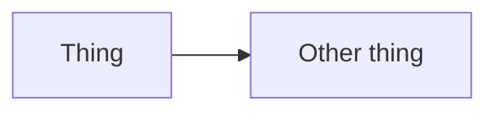

# <Concept name>

One sentence: what this concept is.

## Shape

Describe the shape. A diagram helps if the concept has parts that relate:



Or a plain code sketch:

```ts twoslash
// A snippet that clarifies the shape, not one you'd copy-paste to run.
```

## Why it looks this way

The design trade-off. What we optimize for. What we accept as cost.

## Alternatives considered

- **Alternative A** — reason we didn't pick it.
- **Alternative B** — reason we didn't pick it.

## See also

- Link to the ADR that recorded this decision.
- Link to related Explanation pages.
- Link to how-tos that put this concept to work.
