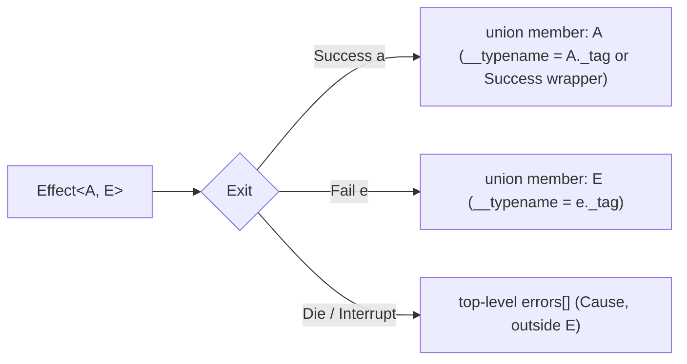

# Errors as data

Typed Effect errors surface as members of a derived GraphQL result union, so clients pattern-match `__typename` instead of parsing top-level `errors[]`.

When a field's `Rpc.make` declares a non-empty `error` schema, the library derives `{Op}Result = <Success> | Err1 | Err2 …` and encodes `Effect.fail(err)` as the union member whose `__typename` matches the error's `_tag`. Fields with no declared errors return their success type directly — no union, no wrapper.

## Shape

The result union mirrors `Exit<A, E>` one-to-one:



Declare the success and error schemas on the `Rpc`, then fail with the typed error from any resolver or guard:

```ts twoslash
import { Context, Effect, Layer, Schema } from "effect"
import { Rpc } from "effect/unstable/rpc"
import { Provider, ProviderRequest } from "effect-graphql"

class Secret extends Schema.Class<Secret>("Secret")({
  value: Schema.String,
}) {}

class Forbidden extends Schema.Class<Forbidden>("Forbidden")({
  _tag: Schema.Literal("Forbidden"),
  reason: Schema.String,
}) {}

class Auth extends Context.Service<Auth, { readonly role: string }>()("app/Auth") {}

const adminOnly = Effect.gen(function*() {
  const auth = yield* Auth
  if (auth.role !== "admin") {
    yield* Effect.fail(new Forbidden({ _tag: "Forbidden", reason: "admin only" }))
  }
})

const provider = Provider.make({
  app: Layer.empty,
  request: Layer.effect(Auth)(
    Effect.gen(function*() {
      const request = yield* ProviderRequest
      const role = request.headers["x-role"]
      return { role: typeof role === "string" ? role : "guest" }
    }),
  ),
  query: {
    secret: Provider.field({
      rpc: Rpc.make("secret", { success: Secret, error: Forbidden }),
      guards: [adminOnly],
      resolve: () => Effect.succeed(new Secret({ value: "42" })),
    }),
  },
})
```

The generated schema exposes `secret: SecretResult` where `SecretResult = Secret | Forbidden`. The client selects on `__typename` and each variant's own fields with inline fragments:

```ts twoslash
import { Context, Effect, Layer, Schema } from "effect"
import { Rpc } from "effect/unstable/rpc"
import { Provider, Executor, ProviderRequest } from "effect-graphql"

class Secret extends Schema.Class<Secret>("Secret")({
  value: Schema.String,
}) {}

class Forbidden extends Schema.Class<Forbidden>("Forbidden")({
  _tag: Schema.Literal("Forbidden"),
  reason: Schema.String,
}) {}

class Auth extends Context.Service<Auth, { readonly role: string }>()("app/Auth") {}

const adminOnly = Effect.gen(function*() {
  const auth = yield* Auth
  if (auth.role !== "admin") {
    yield* Effect.fail(new Forbidden({ _tag: "Forbidden", reason: "admin only" }))
  }
})

const provider = Provider.make({
  app: Layer.empty,
  request: Layer.effect(Auth)(
    Effect.gen(function*() {
      const request = yield* ProviderRequest
      const role = request.headers["x-role"]
      return { role: typeof role === "string" ? role : "guest" }
    }),
  ),
  query: {
    secret: Provider.field({
      rpc: Rpc.make("secret", { success: Secret, error: Forbidden }),
      guards: [adminOnly],
      resolve: () => Effect.succeed(new Secret({ value: "42" })),
    }),
  },
})

const executor = Executor.make(provider)

const query = `{
  secret {
    __typename
    ... on Secret { value }
    ... on Forbidden { reason }
  }
}`

const asAdmin = await executor.execute({
  query,
  request: { method: "POST", url: "/graphql", headers: { "x-role": "admin" }, body: null },
})

const asGuest = await executor.execute({
  query,
  request: { method: "POST", url: "/graphql", headers: { "x-role": "guest" }, body: null },
})
```

Both calls return `errors: undefined`. The union member changes:

- `asAdmin.data` is `{ secret: { __typename: "Secret", value: "42" } }`.
- `asGuest.data` is `{ secret: { __typename: "Forbidden", reason: "admin only" } }`.

The guard's `Effect.fail(new Forbidden(...))` reifies through the same `error` schema declared on the `Rpc`. The resolver never ran for the guest call; the union member came from the guard's failure channel.

## Why it looks this way

Two properties fall out of encoding failures as data:

**Client typing.** GraphQL codegen produces a discriminated union for `SecretResult`. Clients narrow on `__typename` and the compiler forces per-variant handling — a business failure can't be silently treated as a network error, and a new error variant added on the server becomes a compile error at every call site until it's handled.

**Reserved semantics for `errors[]`.** The top-level `errors[]` array stays for defects and interrupts — the `Cause`, outside `E`. That's where GraphQL's null-propagation is the correct behaviour: an unexpected failure nulls the subtree and reports the trace. Expected failures declared in the schema stay in the data, where the client contract lives. ADR 0002 records this split.

## Alternatives considered

- **Top-level `errors[]` with codes in `extensions`** — discards the typed-error advantage. Clients string-match codes at runtime, and every business failure subjects the response to null propagation.
- **Relay-style payload object** (`{ ...success, errors: [...] }`) — co-mingles success and error fields on one object. The type system can't force the client to handle each variant, and the payload shape drifts as errors are added.
- **Object-success-only union** — restricts unions to object types, which breaks common scalar- and list-returning operations. The library wraps non-object success in a `{Op}Success { data: T }` member instead, so any success schema works.

## See also

- [Declare root operations](/root-operations) — the `Provider.field` and `Rpc.make` primitives this page builds on.
- [ADR 0002 — Typed errors as data; defects masked](https://github.com/egriff38/effect-graphql/blob/master/packages/core/docs/adr/0002-typed-errors-as-data.md) — the decision record and rejected alternatives in full.
