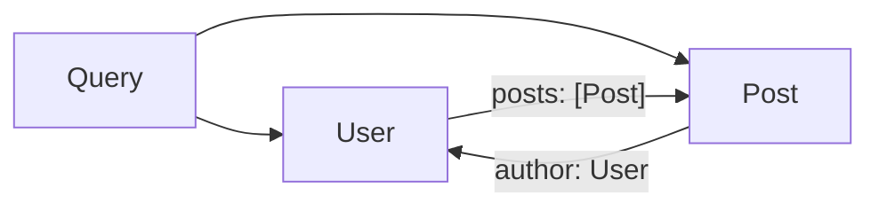

# Types and augmentations

A `Schema.Class` is a nominal identifier for a GraphQL object type; a
`Provider.augment` call attaches a field to that type without editing the
class body. Together they let you model relationships like `User.posts →
Post.author → User` without runtime cycles or a schema-level DSL.

## Shape

A type declares its own scalar fields. A capability — a field that resolves
against a runtime — lives outside the class:

```ts twoslash
import { Schema } from "effect"

class User extends Schema.Class<User>("User")({
  id: Schema.String.annotate({ graphql: { id: true } }),
  name: Schema.String,
}) {}

class Post extends Schema.Class<Post>("Post")({
  id: Schema.String.annotate({ graphql: { id: true } }),
  title: Schema.String,
  authorId: Schema.String,
}) {}
```

Neither class knows about the other. `Post.authorId` is a scalar; there is
no `Post.author: User` field in the class body and no `User.posts: [Post]`
field either.

Two `Provider.augment` calls layer the relationship on:

```ts twoslash
import { Effect, Layer, Schema } from "effect"
import { Rpc } from "effect/unstable/rpc"
import { Provider } from "effect-graphql"

class User extends Schema.Class<User>("User")({
  id: Schema.String.annotate({ graphql: { id: true } }),
  name: Schema.String,
}) {}

class Post extends Schema.Class<Post>("Post")({
  id: Schema.String.annotate({ graphql: { id: true } }),
  title: Schema.String,
  authorId: Schema.String,
}) {}

const USERS: User[] = [new User({ id: "u1", name: "Ada" })]
const POSTS: Post[] = [new Post({ id: "p1", title: "Hi", authorId: "u1" })]

const provider = Provider.make({
  app: Layer.empty,
  request: Layer.empty,
  query: {
    users: Provider.field({
      rpc: Rpc.make("users", { success: Schema.Array(User) }),
      resolve: () => Effect.succeed(USERS),
    }),
  },
  augmentations: [
    Provider.augment(
      User,
      Rpc.make("posts", { success: Schema.Array(Post) }),
      (user) =>
        Effect.succeed(POSTS.filter((p) => p.authorId === user.id)),
    ),
    Provider.augment(
      Post,
      Rpc.make("author", { success: Schema.NullOr(User) }),
      (post) => Effect.succeed(USERS.find((u) => u.id === post.authorId) ?? null),
    ),
  ],
})
```

The derived SDL contains a cyclic type graph even though the TypeScript
classes never mention each other:



## Why it looks this way

**Nominal recursion.** `Schema.Class<User>("User")` is a nominal identifier.
`Provider.augment(User, ..., (user) => …)` closes over the class value, not
its structural body, so a `User.posts: [Post]` field can reference `Post`
before you declare `Post` at the type level — and vice versa. You never
reach for `Schema.suspend` in the common case. Builders that pin the graph
inside a fluent chain (SDL-first codegen, Pothos-style `.field(…)`
callbacks) turn every recursive edge into a scoping problem the reader
has to think about.

**Separation of ownership.** A `Schema.Class` is a **type** — its shape
belongs to whichever module owns that domain concept. An augmentation is
a **capability** — a resolver that depends on services in the request
runtime. Different modules can own each. The `posts` service can attach
a `User.posts` field without touching `packages/user/User.ts`; the auth
service can attach `User.permissions` without either package importing
the other.

## Alternatives considered

- **Fields inside `Schema.Class` bodies** — putting `posts: Schema.Array(Post)`
  on `User` forces the class to know its resolver's dependencies (a
  `Layer`, a batched loader, an auth guard). One module ends up owning
  both the shape and every capability that touches it. Cross-module
  relationships need mutual imports.
- **A builder DSL** — a chained `type("User").field("posts", ...)` API
  reintroduces the SDL-first / resolvers-second split the library sets out
  to avoid. It also loses TypeScript's structural inference: the parent
  type on a resolver arrives typed as `User` because
  `Provider.augment(User, ...)` closes over the class, not a string name.

## See also

- [Declare root operations](/root-operations) — the sibling case:
  fields on `Query` and `Mutation`.
- [Batching](/batching) — how augmentation resolvers avoid N+1 with
  `Provider.batch`.
- [ADR 0004: annotation-driven type mapping](https://github.com/egriff38/effect-graphql/blob/master/packages/core/docs/adr/0004-annotation-driven-type-mapping.md)
  — the deriver rules that turn a `Schema.Class` into a GraphQL object
  type.
